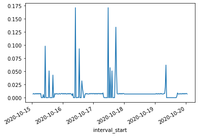

# Advanced Queries

As well as the required arguments which appear in the end-point function signatures, there are also a number of parameters which can be passed as kwargs to each of them - these are listed in the docstrings. In this example we'll specify a time-period to query electricity consumption between.


```python
s_elec_consumption = download_manager.create_elec_consumption_s(period_from='2020-10-15T00:00:00Z', 
                                                                period_to='2020-10-20T00:00:00Z')

s_elec_consumption.plot()
```


    

